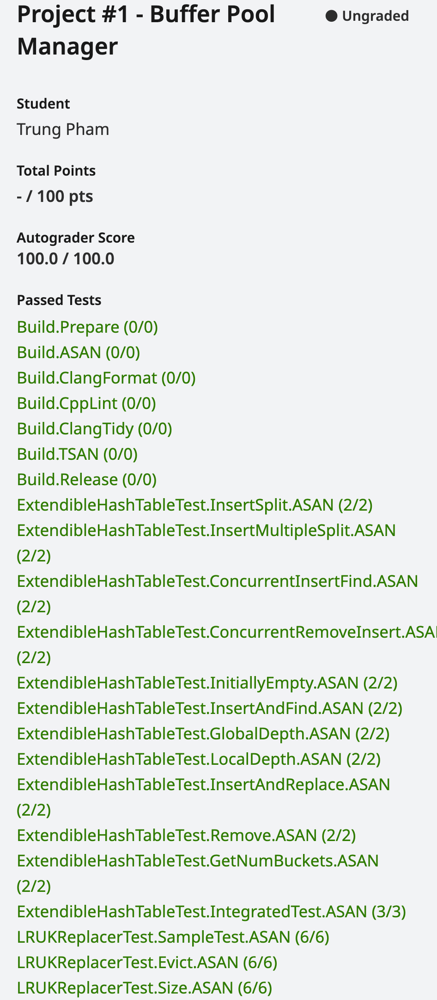
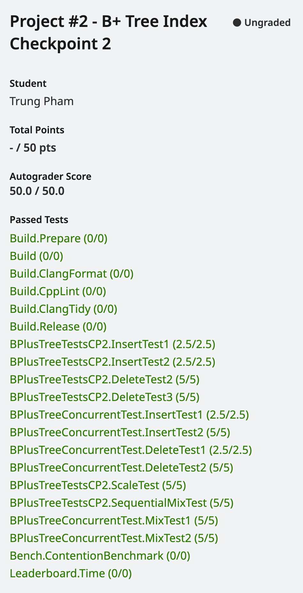
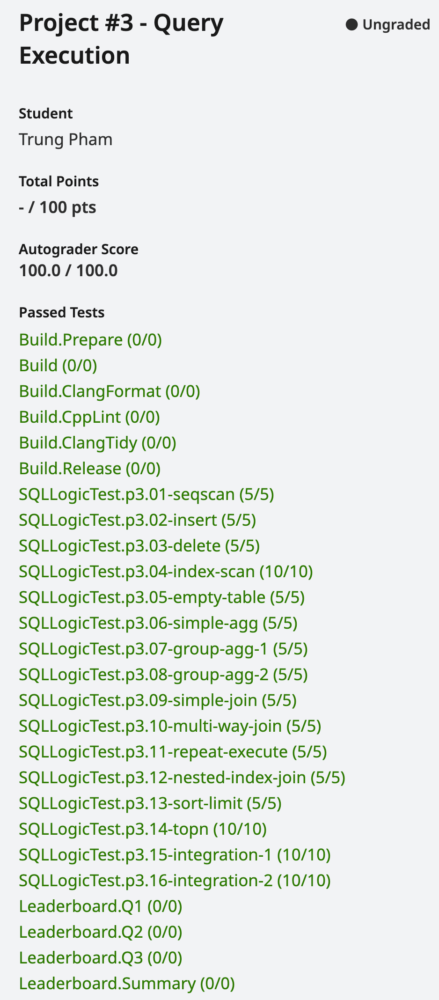

-----------------

BusTub is a relational database management system built at [Carnegie Mellon University](https://db.cs.cmu.edu) for the [Introduction to Database Systems](https://15445.courses.cs.cmu.edu) (15-445/645) course. This system was developed for educational purposes and should not be used in production environments.

BusTub supports basic SQL and comes with an interactive shell. You can get it running after finishing all the course projects.

-----------------

Project 1: Buffer Pool Manager.

Project 2: B+Tree Index.

Project 3 & 4: Query Execution and Concurrency Control.

